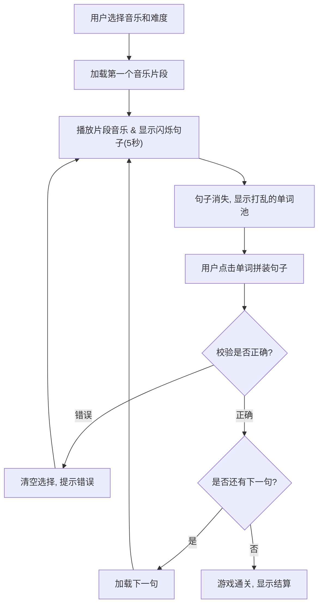

## 1. 产品概述
一款通过音乐和游戏化方式学习英语的跨端Web应用。
- 核心目的是解决移动端打字练习不便的问题，通过“听音乐 + 瞬时记忆 + 点选单词拼接”的创新玩法，让用户在轻松的音乐氛围中掌握英语句子。
- 目标用户是希望通过碎片化时间、以娱乐方式提升英语听力和语感的英语学习者。

## 2. 核心功能

### 2.1 用户角色
| 角色 | 注册方式 | 核心权限 |
|------|---------------------|------------------|
| 玩家 | 暂无需注册（本地记录） | 浏览曲库、选择难度、进行音乐填词游戏 |
| 管理员 | 独立入口/密码 | 管理音乐库、管理对应的英语句子及时间轴 |

### 2.2 功能模块
1. **曲库首页**: 展示可用音乐列表、难度选择、游戏入口。
2. **游戏主页**: 核心玩法页面（音频播放、句子闪烁记忆、单词点选、正确/错误反馈）。
3. **管理后台**: 音乐列表管理（添加/删除音乐）、句子时间轴管理（为音乐添加对应时段的英语句子和干扰词）。

### 2.3 页面详情
| 页面名称 | 模块名称 | 功能描述 |
|-----------|-------------|---------------------|
| 曲库首页 | 音乐列表 | 展示所有音乐卡片，包含封面、歌曲名、难度选项（初级、中级、高级） |
| 游戏主页 | 音乐播放器 | 播放当前句子的音乐片段 |
| 游戏主页 | 记忆展示区 | 音乐播放时，同步显示该段对应的英语句子，持续闪烁并在5秒后隐藏 |
| 游戏主页 | 单词选择区 | 句子隐藏后，打乱显示句子中的单词（可根据难度加入干扰词），供用户点击拼装 |
| 游戏主页 | 结果反馈区 | 拼装完成后进行校验：错误则提示并重播该段音乐，正确则播放特效并进入下一句 |
| 管理后台 | 音乐管理 | 上传/配置音乐资源（URL）、封面、名称、歌手等 |
| 管理后台 | 句子管理 | 针对具体音乐，配置每个学习片段的开始时间、结束时间、原句、中文翻译 |

## 3. 核心流程
游戏核心玩法流程：
1. 用户在首页选择一首音乐及难度，进入游戏。
2. 系统加载该音乐的第一个句子片段。
3. 播放音乐片段，屏幕中央显示该英语句子，文字闪烁并在5秒后消失。
4. 屏幕下方出现打乱的单词气泡（包含正确单词和难度附加的干扰词）。
5. 用户依次点击单词气泡拼出句子。
6. 用户提交或拼完最后一个词时，系统校验：
   - 如果错误：清空用户选择，提示错误，并重新播放该片段音乐。
   - 如果正确：播放成功音效/动画，进入下一个句子片段；若为最后一句，则游戏通关，展示结算页面。

## 4. 用户界面设计

### 4.1 设计风格
- **主色调**: 沉浸式的深色背景（如深紫、深蓝，类似星空或赛博朋克风格），搭配高对比度的荧光色（霓虹绿、亮粉、电光蓝）作为操作反馈。
- **字体**: 英文字体采用圆润、有活力的无衬线体（如 Quicksand 或 Nunito），数字及UI文字要求高清晰度。
- **按钮及组件**: 游戏化风格，采用带有微弱发光阴影的卡片和按钮（Glassmorphism 或 Neumorphism结合霓虹效果），点击有明显的物理按压或缩放反馈。
- **动效 (Motion)**: 极其重要。单词闪烁需要有呼吸感；单词选中和取消要有平滑的位移和缩放过渡；正确匹配时要有粒子爆炸或撒花特效；错误时有屏幕震动（Shake）效果。

### 4.2 页面设计概述
| 页面名称 | 模块名称 | UI 元素及交互要求 |
|-----------|-------------|-------------|
| 游戏主页 | 播放区 | 顶部显示当前进度条和动态音频波形（随音乐律动）。 |
| 游戏主页 | 记忆区 | 屏幕中央居中大字号显示句子，带有霓虹发光效果，倒计时5秒渐隐。 |
| 游戏主页 | 操作区 | 底部为单词气泡池。单词气泡大小适中，易于移动端手指点击。点击后飞入组装区。 |
| 管理后台 | 列表区 | 极简、高效的数据表格风格，提供清晰的新增、编辑、删除按钮。 |

### 4.3 响应式
- **优先移动端**: 考虑到用户的“不便打字”痛点，界面布局优先满足移动端单手或双手拇指点击操作。单词池在底部，拼装区在偏中下位置。
- **PC端适配**: 在宽屏下采用居中卡片式布局，左右两侧可增加游戏装饰元素或排行榜，保持核心操作区比例适中。
