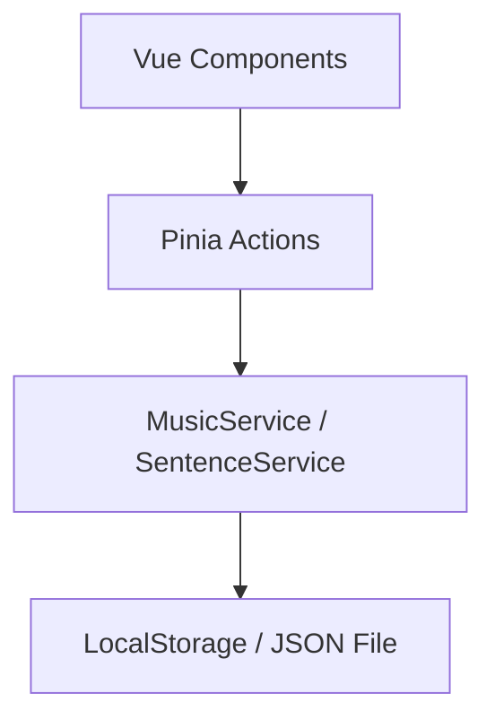
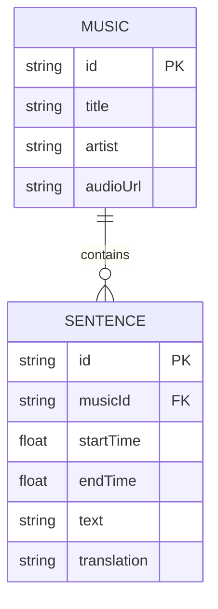

## 1. 架构设计

```mermaid
graph TD
    subgraph Frontend [Vue 3 前端]
        UI[UI 组件库 - TailwindCSS]
        Store[状态管理 - Pinia]
        Router[路由 - Vue Router]
        Audio[音频引擎 - Howler.js]
    end
    
    subgraph Data [数据层]
        Local[LocalStorage (数据持久化/模拟后端)]
    end
    
    UI --> Store
    UI --> Router
    Store --> Local
    Store --> Audio
```

## 2. 技术描述

- **核心框架**: Vue 3 (Composition API) + Vite (构建工具)
- **样式方案**: Tailwind CSS (原子化 CSS) + Vue 动态 Transition (实现单词飞入和闪烁效果)
- **状态管理**: Pinia (用于管理当前游戏状态、播放进度、选中单词列表、难度模式)
- **音频控制**: Howler.js (用于精确控制音乐片段的播放、暂停、跳转及循环播放，比原生 Audio 标签更稳定且易于处理音频 sprites 或时间轴截取)
- **数据持久化**: LocalStorage (用于存储用户进度、管理员配置的音乐库和句子列表)。未来若引入真实后端，可无缝替换为 Axios 请求。

## 3. 路由定义

| 路由 | 目的 |
|-------|---------|
| `/` | 曲库首页，展示所有可玩音乐列表 |
| `/game/:musicId` | 游戏主页，加载对应音乐的关卡数据并开始游戏 |
| `/admin` | 管理后台首页，提供音乐和句子管理入口 |
| `/admin/music` | 音乐库管理（增删改查） |
| `/admin/sentences/:musicId` | 针对特定音乐的句子时间轴管理 |

## 4. API 定义 (LocalStorage 模拟接口)

```typescript
// 定义歌曲实体
interface Music {
  id: string;
  title: string;
  artist: string;
  coverUrl: string; // 封面图片
  audioUrl: string; // 音频文件地址
  difficulty: 'EASY' | 'MEDIUM' | 'HARD'; // 默认难度
}

// 定义句子/歌词片段实体
interface Sentence {
  id: string;
  musicId: string;
  startTime: number; // 开始时间 (秒)
  endTime: number; // 结束时间 (秒)
  text: string; // 英语原句
  translation: string; // 中文翻译
  distractors?: string[]; // 针对高级难度的干扰词
}

// 定义用户游戏记录
interface GameRecord {
  musicId: string;
  completedAt: number;
  score: number;
}
```

## 5. 服务端架构图 (无后端，基于本地数据源)



## 6. 数据模型

### 6.1 数据模型定义



### 6.2 初始数据结构 (示例)

```json
{
  "musics": [
    {
      "id": "m1",
      "title": "Shape of You",
      "artist": "Ed Sheeran",
      "coverUrl": "https://example.com/cover1.jpg",
      "audioUrl": "https://example.com/audio1.mp3",
      "difficulty": "EASY"
    }
  ],
  "sentences": [
    {
      "id": "s1",
      "musicId": "m1",
      "startTime": 0.5,
      "endTime": 3.0,
      "text": "The club isn't the best place to find a lover",
      "translation": "夜店不是寻找真爱的最佳场所"
    }
  ]
}
```