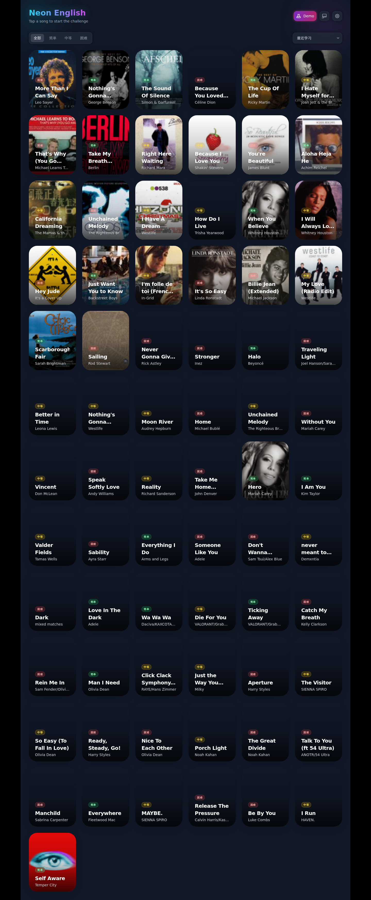

# English Music Game

一个用于英语听力与句子重排练习的 Web 小游戏：选择歌曲 → 听一句歌词片段 → 记忆并重排句子 → 进入下一句。

**说明：本仓库仅用于开源学习与非商业用途。**

## 截图



## 本地运行

```bash
npm ci
npm run dev
```

打开 `http://127.0.0.1:5173/`。

## 版权与使用限制（重要）

- 本项目代码开源，**仅供学习/参考/研究使用**，请勿用于任何商业用途。
- 项目内可能包含第三方音乐/歌词/封面等资源（或其链接），其版权归原版权方所有。
- 如果你计划将本项目用于公开发布、商业分发或大规模传播，请务必自行确认并获得相应授权；否则请移除相关音频/封面/歌词数据后再使用。
- 如有侵权疑虑或需下架某些资源，请提 Issue 或联系仓库维护者处理移除。
